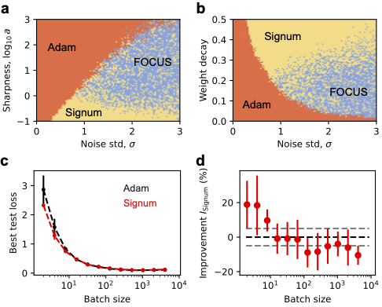

# Good training may require FOCUS

This is the github repo for the paper ["FOCUS: First Order Concentrated Updating Scheme"](https://arxiv.org/abs/2501.12243).

Our results contribute to both scientific understanding of training dynamics and practical speedup in LLM pretraining. We propose a minimum model with sharp valley and gradient noise to study training dynamics. We then have a better understanding of Adam’s advantage in dealing with the sharpness and its limitation when gradient noise is large. Finally, we propose FOCUS using attraction force to squeeze into valleys without decreasing effective step size much, which gains actual speedup in training GPT-2 (small).

## FOCUS: First Order Concentrated Updating Scheme

The pseudocode is given as follows and the code is in [focus.py](focus.py). The hyparameter $\beta_2$ is the decay rate for the EMA of parameters and $\gamma$ controls the strength of "attraction force".

## Toy landscape

Our picture of the LLM landscape is a narrowing valley. We scanned the best performance of different optimizers on this toy landscape. The best optimizer at a given condition is represented by a color (Adam: orange; Signum: yellow; FOCUS: blue), yielding the following phase diagram (panels a and b). The code can be found in ['./Toy'](./Toy/). See detailed explainations of the code in Appendix.

## MNIST

We found that small batch sizes (larger noise in gradient) indeed lead to Signum outperforming Adam in MNIST classification (above figure, panels c and d). The code for this is in ['./MNIST'](./MNIST/). See detailed explainations of the code in Appendix.

## GPT-2

The GPT-2 training code is slightly modified from the [Sophia paper](https://github.com/Liuhong99/Sophia/tree/main). We simply added FOCUS to ['./GPT2/model.py'](./GPT2/model.py) and changed to use 8 V100 GPUs on 4 nodes (see .sh files in ['./GPT2'](./GPT2/)).

FOCUS is more stable than Signum and Adam on our machines. Compared to Adam baseline in the [Sophia paper](https://github.com/Liuhong99/Sophia/tree/main), FOCUS is also faster.

